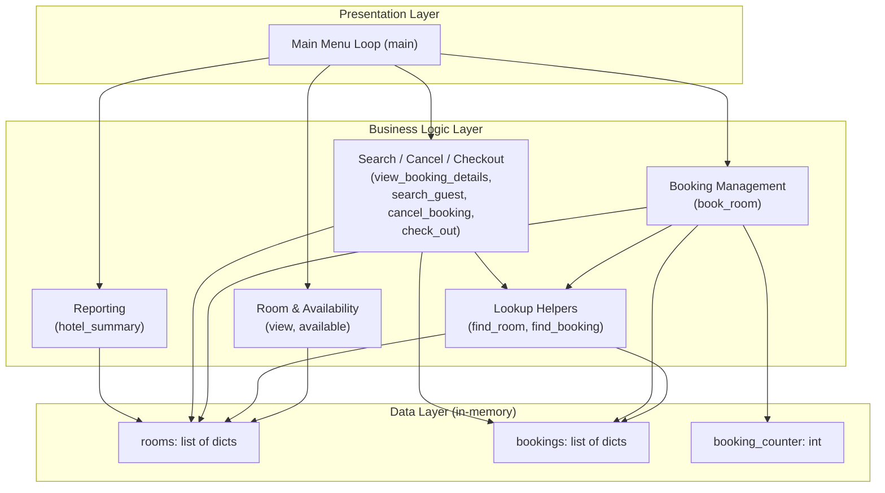
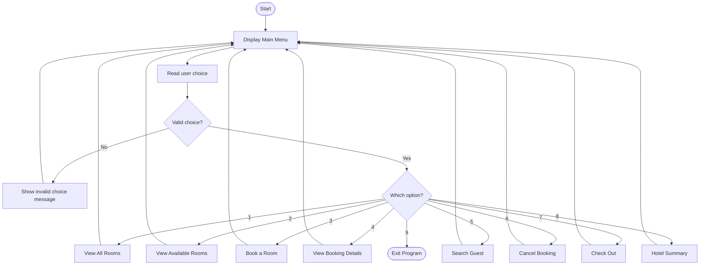
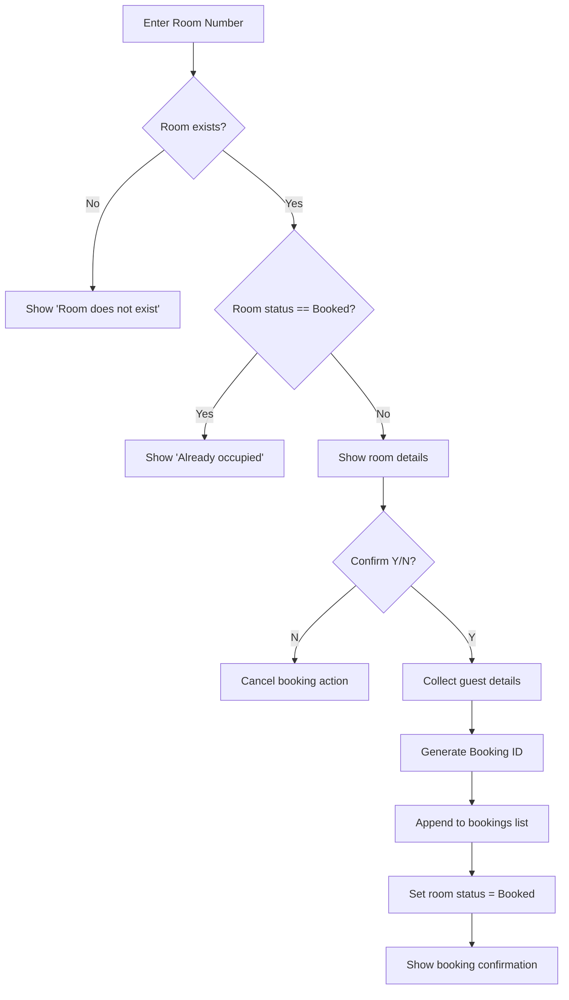
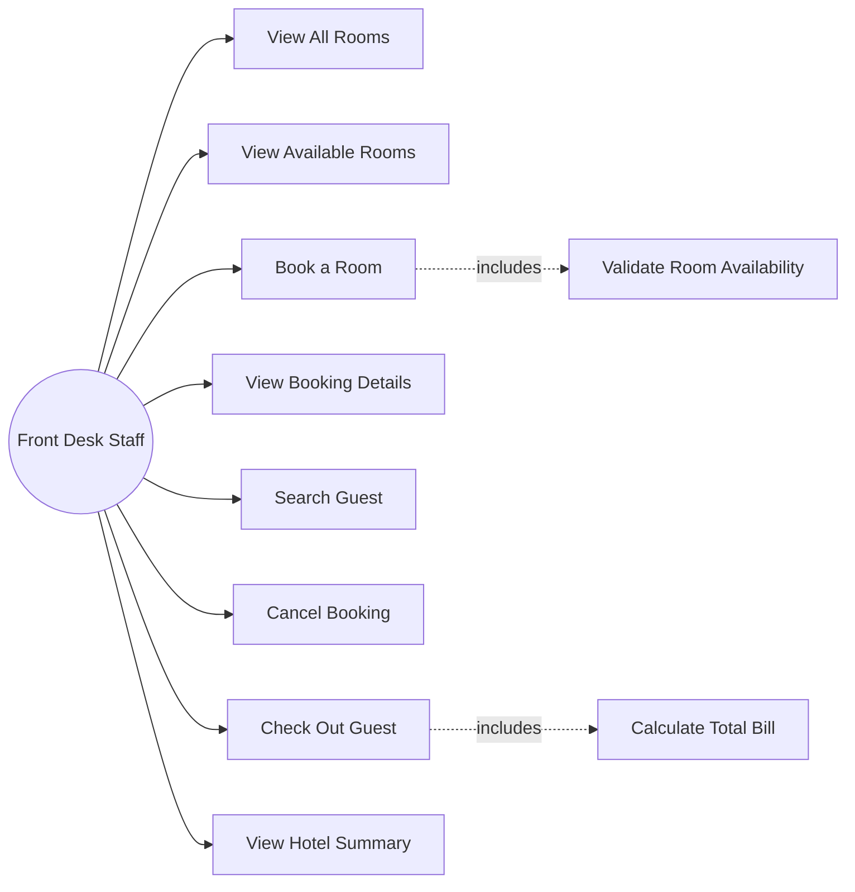
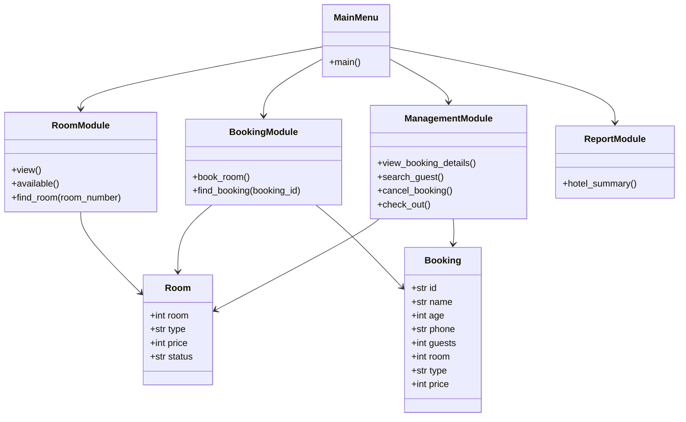
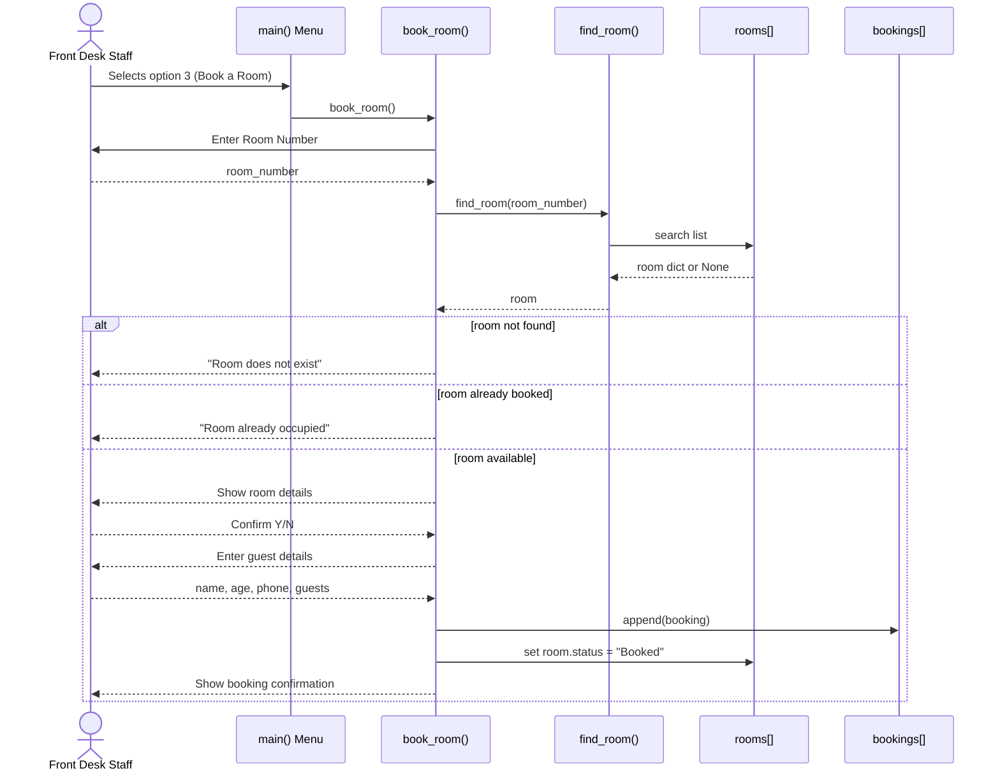

# Hotel Room Allotment System — Design Document

## 1. Objectives

- Maintain an accurate, real-time record of which rooms are available or booked
- Allow front-desk staff to book a room for a guest while preventing double-booking
- Allow retrieval of booking details by Booking ID or by guest name
- Support cancellation and checkout, including bill calculation based on nights stayed
- Provide a hotel-wide occupancy summary for quick reporting
- Demonstrate correct use of core Python constructs (lists, dictionaries, functions,
  loops, conditionals, input validation) in a single cohesive application

## 2. Functional Requirements

The system is built around **three major functional modules**:

**Module 1 — Room & Availability Management**
- Displays all rooms with type, price, and current status (`view()`)
- Filters and displays only currently available rooms (`available()`)
- Tracks room status (`Available` / `Booked`) in real time as bookings and checkouts occur

**Module 2 — Booking Management**
- Accepts guest details (name, age, phone number, number of guests) (`book_room()`)
- Validates room existence and availability before confirming a booking
- Prevents double-booking of an already-occupied room
- Generates a unique Booking ID (`B001`, `B002`, ...) for each confirmed booking
- Displays a booking confirmation summary

**Module 3 — Search, Cancellation & Checkout**
- Retrieves booking details by Booking ID (`view_booking_details()`)
- Searches bookings by guest name (`search_guest()`)
- Cancels an existing booking and reverts the room to `Available` (`cancel_booking()`)
- Processes checkout: calculates total cost as nights × room price, then frees the room (`check_out()`)
- Generates a hotel-wide summary of occupancy by status and room type (`hotel_summary()`)

**Clear Input/Output Structure**

| Action | Input | Output |
|---|---|---|
| View rooms | Menu choice | Table of all rooms with status |
| View available rooms | Menu choice | List of rooms currently free |
| Book a room | Room number, guest details, confirmation (Y/N) | Booking confirmation with Booking ID |
| View booking details | Booking ID | Full booking record |
| Search guest | Guest name | Matching booking details |
| Cancel booking | Booking ID, confirmation (Y/N) | Cancellation confirmation, room freed |
| Checkout | Booking ID, number of nights | Total bill, checkout confirmation |
| Hotel summary | Menu choice | Occupancy statistics |

## 3. Non-Functional Requirements

**Usability** — A clear, numbered menu (1–9) with descriptive labels lets a
non-technical user operate the system without instructions. Y/N confirmation
prompts precede irreversible actions (booking, cancellation).

**Reliability** — Room status and booking records stay consistent: a room is
only marked `Booked` after a successful booking and is reliably reverted to
`Available` on cancellation or checkout, avoiding state mismatches.

**Error Handling / Robustness** — Input is validated at each step: non-numeric
room numbers, ages, or guest counts are caught with `try/except ValueError`
instead of crashing the program; invalid menu choices are rejected with a
clear message; booking a non-existent or already-occupied room is explicitly
blocked.

**Maintainability** — The code is organized into small, single-purpose
functions (`book_room()`, `cancel_booking()`, `check_out()`, etc.) rather
than one long script, so each feature can be modified independently.

**Resource Efficiency** — The system uses lightweight in-memory data
structures (lists and dictionaries) with no external database or network
dependency, so it runs instantly on any machine with a standard Python
interpreter.

## 4. System Architecture Diagram

## 5. Process Flow / Workflow Diagram

**Booking sub-flow in detail:**

## 6. UML Diagrams

### 6.1 Use Case Diagram

### 6.2 Class / Component Diagram

> The current implementation is function-based rather than class-based
> (as expected at first-semester level), so this diagram represents the
> system as **modules/components** and the **data records** they operate on.

### 6.3 Sequence Diagram — Booking a Room

## 7. Storage Design

The system does not use an external database — all data is held **in
memory** for the duration of the program's execution, using Python lists
of dictionaries as the storage structures. This satisfies the project's
"Database/Storage Design (if applicable)" requirement in place of an ER
diagram, since no relational database is involved.

### 7.1 `rooms` — Room Record Schema

| Field | Type | Description |
|---|---|---|
| `room` | int | Unique room number (primary key) |
| `type` | str | Room category — `Single`, `Double`, `Deluxe` |
| `price` | int | Price per night (₹) |
| `status` | str | `Available` or `Booked` |

### 7.2 `bookings` — Booking Record Schema

| Field | Type | Description |
|---|---|---|
| `id` | str | Unique Booking ID (primary key), format `B001`, `B002`, ... |
| `name` | str | Guest name |
| `age` | int | Guest age |
| `phone` | str | Guest phone number |
| `guests` | int | Number of guests staying |
| `room` | int | Foreign key referencing `rooms.room` |
| `type` | str | Room type at time of booking (denormalized for quick display) |
| `price` | int | Room price at time of booking (denormalized for billing) |

**Relationship:** one `room` can have at most one active `booking` at a
time (1-to-0/1 relationship), enforced in code by the `status` check in
`book_room()` before a new booking is created.
